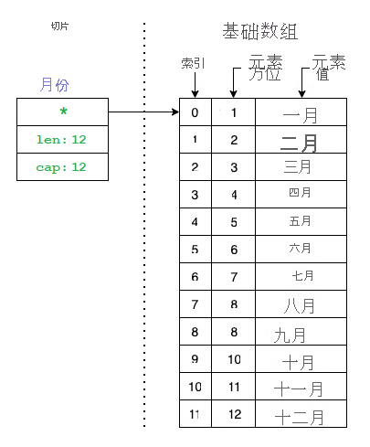
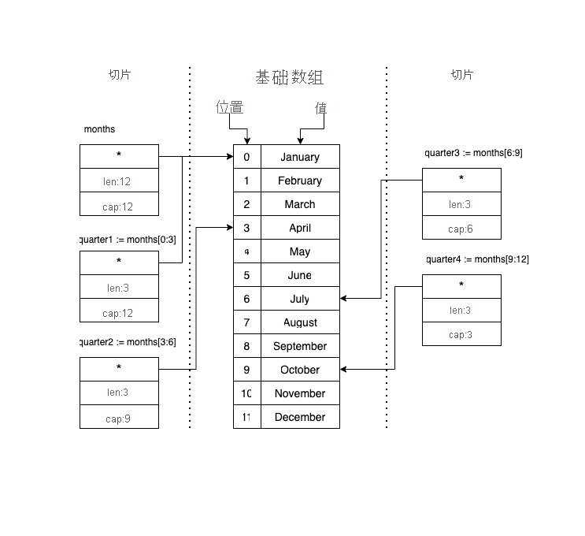

Go 中的数组是一种特定类型且长度固定的数据结构。 它们可具有零个或多个元素，你必须在声明或初始化它们时定义大小。 此外，它们一旦创建，就无法调整大小。 鉴于这些原因，数组在 Go 程序中并不常用，但它们是切片和映射的基础。

## 声明数组

要在 Go 中声明数组，必须定义其元素的数据类型以及该数组可容纳的元素数目。 然后，可采用下标表示法访问数组中的每个元素，其中第一个元素是 0，最后一个元素是数组长度减去 1（长度 - 1）。

例如，让我们使用以下代码：

```go
package main

import "fmt"

func main() {
    var a [3]int
    a[1] = 10
    fmt.Println(a[0])
    fmt.Println(a[1])
    fmt.Println(a[len(a)-1])
}
```

运行上述代码时，你会获得以下输出：

输出

```output
0
10
0
```

即使已声明数组，访问其元素时也不会遇到错误。 默认情况下，Go 会用默认数据类型初始化每个元素。 这样的话，`int` 的默认值为零。 不过，你可为特定位置分配值。 这就是为什么你会看到 `a[1] = 10`。 你可采用上述表示法来访问该元素。 另请注意，为了打印出第一个元素，我们使用了 `a[0]`。 为了打印出最后一个元素，我们使用了 `a[len(a)-1]`。 `len` 函数是 Go 中的内置函数，用于获取数组、切片或映射中的元素数。

## 初始化数组

声明数组时，还可使用非默认值来初始化数组。 例如，你可使用以下代码来查看和测试语法：

```go
package main

import "fmt"

func main() {
    cities := [5]string{"New York", "Paris", "Berlin", "Madrid"}
    fmt.Println("Cities:", cities)
}
```

运行上述代码，你应会看到以下输出：

输出

```output
Cities: [New York Paris Berlin Madrid ]
```

即使数组应具有 5 个元素，也无需为所有元素分配值。 如上所示，最新位置包含一个空的字符串，因为它是字符串数据类型的默认值。

## 数组中的省略号

如果你不知道你将需要多少个位置，但知道你将具有多少数据，那么还有一种声明和初始化数组的方法是使用省略号 (`...`)，如下例所示：

```go
q := [...]int{1, 2, 3}
```

让我们修改在上一部分中使用的程序，以使用省略号。 代码应如下例所示：

```go
package main

import "fmt"

func main() {
    cities := [...]string{"New York", "Paris", "Berlin", "Madrid"}
    fmt.Println("Cities:", cities)
}
```

运行上述代码，你应看到如下例所示的输出：

输出

```output
Cities: [New York Paris Berlin Madrid]
```

你能看出区别吗？ 末尾没有空字符串。 数组长度由你初始化它时输入的字符串决定。 如果你不再需要，则不保留你不知道的内存。

另一种有趣的数组初始化方法是使用省略号并仅为最新的位置指定值。 例如，使用以下代码：

```go
package main

import "fmt"

func main() {
    numbers := [...]int{99: -1}
    fmt.Println("First Position:", numbers[0])
    fmt.Println("Last Position:", numbers[99])
    fmt.Println("Length:", len(numbers))
}
```

运行此代码，你将获得以下输出：

输出

```output
First Position: 0
Last Position: -1
Length: 100
```

请注意数组的长度是 100，因为你为第 99 个位置指定了一个值。 第一个位置打印出默认值（零）。

## 多维数组

如果需要处理复杂数据结构，请记住 Go 支持多维数组。 让我们创建一个程序，在其中声明和初始化一个二维数组。 使用以下代码：

```go
package main

import "fmt"

func main() {
    var twoD [3][5]int
    for i := 0; i < 3; i++ {
        for j := 0; j < 5; j++ {
            twoD[i][j] = (i + 1) * (j + 1)
        }
        fmt.Println("Row", i, twoD[i])
    }
    fmt.Println("\nAll at once:", twoD)
}
```

运行上述程序，你应会看到如下例所示的输出：

输出

```output
Row 0 [1 2 3 4 5]
Row 1 [2 4 6 8 10]
Row 2 [3 6 9 12 15]

All at once: [[1 2 3 4 5] [2 4 6 8 10] [3 6 9 12 15]]
```

你声明了一个二维数组，它指定了数组在第二个维度中的位置数，例如 `var twoD [3][5]int`。 你可将此数组看做一种包含列和行的数据结构，例如电子表格或矩阵。 此时，所有位置均采用默认值（零）。 在 `for` 循环中，我们将在每行上使用不同的值模式初始化每个位置。 最后，将其所有值打印到终端。

如果要声明一个三维数组，会怎么样？ 你可能会猜测要使用的语法是什么，对吧？ 可如下例所示执行此操作：

Go

```go
package main

import "fmt"

func main() {
    var threeD [3][5][2]int
    for i := 0; i < 3; i++ {
        for j := 0; j < 5; j++ {
            for k := 0; k < 2; k++ {
                threeD[i][j][k] = (i + 1) * (j + 1) * (k + 1)
            }
        }
    }
    fmt.Println("\nAll at once:", threeD)
}
```

运行上述代码，你应会看到如下例所示的输出：

输出

```output
All at once: [[[1 2] [2 4] [3 6] [4 8] [5 10]] [[2 4] [4 8] [6 12] [8 16] [10 20]] [[3 6] [6 12] [9 18] [12 24] [15 30]]]
```

如果用可读性更强的格式来设置输出格式，则可能得到如下例所示的内容：

输出

```output
All at once: 
[
    [
        [1 2] [2 4] [3 6] [4 8] [5 10]
    ] 
    [
        [2 4] [4 8] [6 12] [8 16] [10 20]
    ] 
    [
        [3 6] [6 12] [9 18] [12 24] [15 30]
    ]
]
```

请注意与二维数组相比结构的变化。 可根据需要继续尝试更多维度，但由于我们还有其他数据类型需要探索，因此暂时介绍到这里。

## 了解切片

我们在上一部分了解了数组，并了解了数组是切片和映射的基础。 你稍后就会明白是为什么。 与数组一样，切片也是 Go 中的一种数据类型，它表示一系列类型相同的元素。 不过，与数组更重要的区别是切片的大小是动态的，不是固定的。

切片是数组或另一个切片之上的数据结构。 我们将源数组或切片称为基础数组。 通过切片，可访问整个基础数组，也可仅访问部分元素。

切片只有 3 个组件：

- **指向基础数组中第一个可访问元素的指针**。 此元素不一定是数组的第一个元素 `array[0]`。
- **切片的长度**。 切片中的元素数目。
- **切片的容量**。 切片开头与基础数组结束之间的元素数目。

下图显示了什么是切片：



请注意，切片只是基础数组的一个子集。 让我们看看如何用代码来表示上述图像。

## 声明和初始化切片

要声明切片，可采用与声明数组相同的方式操作。 例如，以下代码表示你在切片图像中看到的内容：

```go
package main

import "fmt"

func main() {
    months := []string{"January", "February", "March", "April", "May", "June", "July", "August", "September", "October", "November", "December"}
    fmt.Println(months)
    fmt.Println("Length:", len(months))
    fmt.Println("Capacity:", cap(months))
}
```

运行代码时，你会看到以下输出：

输出

```output
[January February March April May June July August September October November December]
Length: 12
Capacity: 12
```

请注意目前，切片与数组的区别不大。 可用相同的方式声明这两者。 若要从切片中获取信息，可使用内置函数 `len()` 和 `cap()`。 我们将继续使用这些函数来确认切片可具有来自基础数组的后续元素。

## 切片项

Go 支持切片运算符 `s[i:p]`，其中：

- `s` 表示数组。
- `i` 表示指向要添加到新切片的基础数组（或另一个切片）的第一个元素的指针。 变量 `i` 对应于数组 `array[i]` 中索引位置 `i` 处的元素。 请记住，此元素不一定是基础数组的第一个元素 `array[0]`。
- `p` 表示创建新切片时要使用的基础数组中的元素数目。 变量 `p` 对应于可用于新切片的基础数组中的最后一个元素。 可在位置 `array[i+1]` 找到基础数组中位置 `p` 处的元素。 请注意，此元素不一定是基础数组的最后一个元素 `array[len(array)-1]`。

如你所见，切片只能引用元素的子集。

假设你需要 4 个变量来表示一年的每个季度，并且你有一个包含 12 个元素的 `months` 切片。 下图演示了如何将 `months` 切片为 4 个新的 `quarter` 切片：



若要用代码表示在上图中看到的内容，可使用以下代码：

Go

```go
package main

import "fmt"

func main() {
    months := []string{"January", "February", "March", "April", "May", "June", "July", "August", "September", "October", "November", "December"}
    quarter1 := months[0:3]
    quarter2 := months[3:6]
    quarter3 := months[6:9]
    quarter4 := months[9:12]
    fmt.Println(quarter1, len(quarter1), cap(quarter1))
    fmt.Println(quarter2, len(quarter2), cap(quarter2))
    fmt.Println(quarter3, len(quarter3), cap(quarter3))
    fmt.Println(quarter4, len(quarter4), cap(quarter4))
}
```

运行代码时，你会获得以下输出：

输出

```output
[January February March] 3 12
[April May June] 3 9
[July August September] 3 6
[October November December] 3 3
```

请注意，切片的长度不变，但容量不同。 我们来了解 `quarter2` 切片。 声明此切片时，你指出希望切片从位置编号 3 开始，最后一个元素位于位置编号 6。 切片长度为 3 个元素，但容量为 9，原因是基础数组有更多元素或位置可供使用，但对切片而言不可见。 例如，如果你尝试打印类似 `fmt.Println(quarter2[3])` 的内容，会出现以下错误：`panic: runtime error: index out of range [3] with length 3`。

切片容量仅指出切片可扩展的程度。 因此，你可从 `quarter2` 创建扩展切片，如下例所示：

```go
package main

import "fmt"

func main() {
    months := []string{"January", "February", "March", "April", "May", "June", "July", "August", "September", "October", "November", "December"}
    quarter2 := months[3:6]
    quarter2Extended := quarter2[:4]
    fmt.Println(quarter2, len(quarter2), cap(quarter2))
    fmt.Println(quarter2Extended, len(quarter2Extended), cap(quarter2Extended))
}
```

运行上述代码时，你会获得以下输出：

输出

```output
[April May June] 3 9
[April May June July] 4 9
```

请注意在声明 `quarter2Extended` 变量时，无需指定初始位置 (`[:4]`)。 执行此操作时，Go 会假定你想要切片的第一个位置。 你可对最后一个位置 (`[1:]`) 执行相同的操作。 Go 将假定你要引用所有元素，直到切片的最新位置 (`len()-1`)。

## 追加项

我们了解了切片的工作原理，还学习了它们与数组的相似性。 现在，让我们来了解它们与数组之间有何不同。 第一个区别是切片的大小不是固定的，而是动态的。 创建切片后，可向其添加更多元素，这样切片就会扩展。 稍后你将了解基础数组发生的情况。

Go 提供了内置函数 `append(slice, element)`，便于你向切片添加元素。 将要修改的切片和要追加的元素作为值发送给该函数。 然后，`append` 函数会返回一个新的切片，将其存储在变量中。 对于要更改的切片，变量可能相同。

让我们看一下追加进程在代码中的显示方式：

```go
package main

import "fmt"

func main() {
    var numbers []int
    for i := 0; i < 10; i++ {
        numbers = append(numbers, i)
        fmt.Printf("%d\tcap=%d\t%v\n", i, cap(numbers), numbers)
    }
}
```

运行上述代码时，你应会看到以下输出：

输出

```output
0       cap=1   [0]
1       cap=2   [0 1]
2       cap=4   [0 1 2]
3       cap=4   [0 1 2 3]
4       cap=8   [0 1 2 3 4]
5       cap=8   [0 1 2 3 4 5]
6       cap=8   [0 1 2 3 4 5 6]
7       cap=8   [0 1 2 3 4 5 6 7]
8       cap=16  [0 1 2 3 4 5 6 7 8]
9       cap=16  [0 1 2 3 4 5 6 7 8 9]
```

此输出很有意思。 特别是对于调用 `cap()` 函数所返回的内容。 一切看起来都很正常，直到第 3 次迭代，此时容量变为 4，切片中只有 3 个元素。 在第 5 次迭代中，容量又变为 8，第 9 次迭代时变为 16。

你注意到容量输出中的模式了吗？ 当切片容量不足以容纳更多元素时，Go 的容量将翻倍。 它将新建一个具有新容量的基础数组。  无需执行任何操作即可使容量增加。 Go 会自动扩充容量。 需要谨慎操作。 有时，一个切片具有的容量可能比它需要的多得多，这样你将会浪费内存。

## 删除项

你可能想知道，删除元素会怎么样呢？ Go 没有内置函数用于从切片中删除元素。 可使用上述切片运算符 `s[i:p]` 来新建一个仅包含所需元素的切片。

例如，以下代码会从切片中删除元素：

```go
package main

import "fmt"

func main() {
    letters := []string{"A", "B", "C", "D", "E"}
    remove := 2

    if remove < len(letters) {

        fmt.Println("Before", letters, "Remove ", letters[remove])

        letters = append(letters[:remove], letters[remove+1:]...)

        fmt.Println("After", letters)
    }

}
```

运行上述代码时，你会获得以下输出：

输出

```output
Before [A B C D E]
After [A B D E]
```

此代码会从切片中删除元素。 它用切片中的下一个元素替换要删除的元素，如果删除的是最后一个元素，则不替换。

另一种方法是创建切片的新副本。 在下一部分中，我们将了解如何创建切片的副本。

## 创建切片的副本

Go 具有内置函数 `copy(dst, src []Type)` 用于创建切片的副本。 你需要发送目标切片和源切片。 例如，你可如下例所示创建一个切片副本：

```go
slice2 := make([]string, 3)
copy(slice2, letters[1:4])
```

为何要创建副本？ 更改切片中的元素时，基础数组将随之更改。 引用该基础数组的任何其他切片都会受到影响。 让我们在代码中看看此过程，然后创建一个切片副本来解决此问题。

使用下述代码确认切片指向数组，而你在切片中所做的每个更改都会影响基础数组。

```go
package main

import "fmt"

func main() {
    letters := []string{"A", "B", "C", "D", "E"}
    fmt.Println("Before", letters)

    slice1 := letters[0:2]
    slice2 := letters[1:4]

    slice1[1] = "Z"

    fmt.Println("After", letters)
    fmt.Println("Slice2", slice2)
}
```

运行上述代码时，你会看到以下输出：

输出

```output
Before [A B C D E]
After [A Z C D E]
Slice2 [Z C D]
```

请注意对 `slice1` 所做的更改如何影响 `letters` 数组和 `slice2`。 可在输出中看到字母 B 已替换为 Z，它会影响指向 `letters` 数组的每个切片。

若要解决此问题，你需要创建一个切片副本，它会在后台生成新的基础数组。 可以使用以下代码：

```go
package main

import "fmt"

func main() {
    letters := []string{"A", "B", "C", "D", "E"}
    fmt.Println("Before", letters)

    slice1 := letters[0:2]

    slice2 := make([]string, 3)
    copy(slice2, letters[1:4])

    slice1[1] = "Z"

    fmt.Println("After", letters)
    fmt.Println("Slice2", slice2)
}
```

运行上述代码时，你会看到以下输出：

输出

```output
Before [A B C D E]After [A Z C D E]Slice2 [B C D]
```

请注意 `slice1` 中的更改如何影响基础数组，但它并未影响新的 `slice2`。

## 使用映射

大体上来说，Go 中的映射是一个哈希表，是键值对的集合。 映射中所有的键都必须具有相同的类型，它们的值也是如此。 不过，可对键和值使用不同的类型。 例如，键可以是数字，值可以是字符串。 若要访问映射中的特定项，可引用该项的键。

## 声明和初始化映射

若要声明映射，需要使用 `map` 关键字。 然后，定义键和值类型，如下所示：`map[T]T`。 例如，如果要创建一个包含学生年龄的映射，可使用以下代码：

Go

```go
package main

import "fmt"

func main() {
    studentsAge := map[string]int{
        "john": 32,
        "bob":  31,
    }
    fmt.Println(studentsAge)
}
```

运行上述代码时，你会看到以下输出：

输出

```output
map[bob:31 john:32]
```

如果不想使用项来初始化映射，可使用内置函数 `make()` 在上一部分创建切片。 可使用以下代码创建空映射：

```go
studentsAge := make(map[string]int)
```

映射是动态的。 创建项后，可添加、访问或删除这些项。 让我们来了解这些操作。

## 添加项

要添加项，无需像对切片一样使用内置函数。 映射更加简单。 你只需定义键和值即可。 如果没有键值对，则该项会添加到映射中。

让我们使用 `make` 函数重写之前用于创建映射的代码。 然后，将项添加到映射中。 可以使用以下代码：

```go
package main

import "fmt"

func main() {
    studentsAge := make(map[string]int)
    studentsAge["john"] = 32
    studentsAge["bob"] = 31
    fmt.Println(studentsAge)
}
```

运行代码时，你会获得与之前相同的输出：

输出

```output
map[bob:31 john:32]
```

请注意，我们已向已初始化的映射添加了项。 但如果尝试使用 `nil` 映射执行相同操作，会出现错误。 例如，以下代码将不起作用：

```go
package main

import "fmt"

func main() {
    var studentsAge map[string]int
    studentsAge["john"] = 32
    studentsAge["bob"] = 31
    fmt.Println(studentsAge)
}
```

运行上述代码时，会出现以下错误：

输出

```output
panic: assignment to entry in nil map

goroutine 1 [running]:
main.main()
        /Users/johndoe/go/src/helloworld/main.go:7 +0x4f
exit status 2
```

若要避免在将项添加到映射时出现问题，请确保使用 `make` 函数（如我们在上述代码片段中所示）创建一个空映射（而不是 `nil` 映射）。 此规则仅适用于添加项的情况。 如果在 `nil` 映射中运行查找、删除或循环操作，Go 不会执行 panic。 稍后我们将确认该行为。

## 访问项

若要访问映射中的项，可使用常用的下标表示法 `m[key]`，就像操作数组或切片一样。 下面是一个有关如何访问项的简单示例：

```go
package main

import "fmt"

func main() {
    studentsAge := make(map[string]int)
    studentsAge["john"] = 32
    studentsAge["bob"] = 31
    fmt.Println("Bob's age is", studentsAge["bob"])
}
```

在映射中使用下标表示法时，即使映射中没有键，你也总会获得响应。 当你访问不存在的项时，Go 不会执行 panic。 此时，你会获得默认值。 可使用以下代码来确认该行为：

```go
package main

import "fmt"

func main() {
    studentsAge := make(map[string]int)
    studentsAge["john"] = 32
    studentsAge["bob"] = 31
    fmt.Println("Christy's age is", studentsAge["christy"])
}
```

运行上述代码时，你会看到以下输出：

输出

```output
Christy's age is 0
```

在很多情况下，访问映射中没有的项时 Go 不会返回错误，这是正常的。 但有时需要知道某个项是否存在。 在 Go 中，映射的下标表示法可生成两个值。 第一个是项的值。 第二个是指示键是否存在的布尔型标志。

若要解决上一代码片段遇到的问题，可执行以下代码：


```go
package main

import "fmt"

func main() {
    studentsAge := make(map[string]int)
    studentsAge["john"] = 32
    studentsAge["bob"] = 31

    age, exist := studentsAge["christy"]
    if exist {
        fmt.Println("Christy's age is", age)
    } else {
        fmt.Println("Christy's age couldn't be found")
    }
}
```

运行上述代码时，你会看到以下输出：

输出

```output
Christy's age couldn't be found
```

使用第二个代码片段检查映射中的键在你访问之前是否存在。

## 删除项

若要从映射中删除项，请使用内置函数 `delete()`。 下例演示了如何从映射中删除项：

```go
package main

import "fmt"

func main() {
    studentsAge := make(map[string]int)
    studentsAge["john"] = 32
    studentsAge["bob"] = 31
    delete(studentsAge, "john")
    fmt.Println(studentsAge)
}
```

运行代码时，你会获得以下输出：

输出

```output
map[bob:31]
```

正如上述所言，如果你尝试删除不存在的项，Go 不会执行 panic。 下面是该行为的示例：

```go
package main

import "fmt"

func main() {
    studentsAge := make(map[string]int)
    studentsAge["john"] = 32
    studentsAge["bob"] = 31
    delete(studentsAge, "christy")
    fmt.Println(studentsAge)
}
```

运行代码时，你不会遇到错误，而且会看到以下输出：

输出

```output
map[bob:31 john:32]
```

## 映射中的循环

最后，让我们看看如何在映射中进行循环来以编程方式访问其所有的项。 为此，可使用基于范围的循环，如下例所示：

```go
package main

import (
    "fmt"
)

func main() {
    studentsAge := make(map[string]int)
    studentsAge["john"] = 32
    studentsAge["bob"] = 31
    for name, age := range studentsAge {
        fmt.Printf("%s\t%d\n", name, age)
    }
}
```

运行上述代码时，你会看到以下输出：

输出

```output
john    32
bob     31
```

请注意可如何将键和值信息存储在不同的变量中。 在本例中，我们将键保存在 `name` 变量中，将值保存在 `age` 变量中。 因此，`range` 会首先生成项的键，然后再生成该项的值。 可使用 `_` 变量忽略其中任何一个，如下例所示：

```go
package main

import (
    "fmt"
)

func main() {
    studentsAge := make(map[string]int)
    studentsAge["john"] = 32
    studentsAge["bob"] = 31

    for _, age := range studentsAge {
        fmt.Printf("Ages %d\n", age)
    }
}
```

即使在本例中用这种方式打印年龄没有意义，但存在你无需知道项的键的情况。 或者，你可只使用项的键，如下例所示：

```go
package main

import (
    "fmt"
)

func main() {
    studentsAge := make(map[string]int)
    studentsAge["john"] = 32
    studentsAge["bob"] = 31

    for name := range studentsAge {
        fmt.Printf("Names %s\n", name)
    }
}
```

## 使用结构

有时，你需要在一个结构中表示字段的集合。 例如，要编写工资核算程序时，需要使用员工数据结构。 在 Go 中，可使用结构将可能构成记录的不同字段组合在一起。

Go 中的结构也是一种数据结构，它可包含零个或多个任意类型的字段，并将它们表示为单个实体。

在本部分，我们将探索结构为何很重要以及如何使用它们。

## 声明和初始化结构

若要声明结构，需要使用 `struct` 关键字，还要使用希望新的数据类型具有的字段及其类型的列表。 例如，若要定义员工结构，可使用以下代码：

Go

```go
type Employee struct {
    ID        int
    FirstName string
    LastName  string
    Address   string
}
```

然后，可像操作其他类型一样使用新类型声明一个变量，如下所示：

```go
var john Employee
```

如果要在声明变量的同时对其进行初始化，可按以下方式操作：

```go
employee := Employee{1001, "John", "Doe", "Doe's Street"}
```

请注意，必须为结构中的每个字段指定一个值。 但这有时也可能会导致出现问题。 或者，可更具体地了解要在结构中初始化的字段：

```go
employee := Employee{LastName: "Doe", FirstName: "John"}
```

请注意从上述声明中看，为每个字段分配值的顺序不重要。 此外，如果未指定任何其他字段的值，也并不重要。 Go 将根据字段数据类型分配默认值。

若要访问结构的各个字段，可使用点表示法 (`.`) 做到这一点，如下例所示：

```go
employee.ID = 1001
fmt.Println(employee.FirstName)
```

最后，可使用 `&` 运算符生成指向结构的指针，如以下代码所示：

```go
package main

import "fmt"

type Employee struct {
    ID        int
    FirstName string
    LastName  string
    Address   string
}

func main() {
    employee := Employee{LastName: "Doe", FirstName: "John"}
    fmt.Println(employee)
    employeeCopy := &employee
    employeeCopy.FirstName = "David"
    fmt.Println(employee)
}
```

运行上述代码时，你会看到以下输出：

输出

```output
{0 John Doe }
{0 David Doe }
```

请注意在使用指针时结构是如何变为可变结构的。

## 结构嵌入

通过 Go 中的结构，可将某结构嵌入到另一结构中。 有时，你需要减少重复并重用一种常见的结构。 例如，假设你想要重构之前的代码，使其具有两种数据类型，一种针对员工，一种针对合同工。 你可具有一个包含公共字段的 `Person` 结构，如下例所示：

```go
type Person struct {
    ID        int
    FirstName string
    LastName  string
    Address   string
}
```

然后，你可声明嵌入 `Person` 类型的其他类型，例如 `Employee` 和 `Contractor`。 若要嵌入另一个结构，请创建一个新字段，如下例所示：

```go
type Employee struct {
    Information Person
    ManagerID   int
}
```

但是，若要引用 `Person` 结构中的字段，你需要包含员工变量中的 `Information` 字段，如下例所示：

```go
var employee Employee
employee.Information.FirstName = "John"
```

如果你要像我们这样重构代码，则会破坏我们的代码。 或者，你可只包含一个与你要嵌入的结构同名的新字段，如下例所示：

```go
type Employee struct {
    Person
    ManagerID int
}
```

可使用以下代码进行演示：

```go
package main

import "fmt"

type Person struct {
    ID        int
    FirstName string
    LastName  string
    Address   string
}

type Employee struct {
    Person
    ManagerID int
}

type Contractor struct {
    Person
    CompanyID int
}

func main() {
    employee := Employee{
        Person: Person{
            FirstName: "John",
        },
    }
    employee.LastName = "Doe"
    fmt.Println(employee.FirstName)
}
```

请注意如何在无需指定 `Person` 字段的情况下访问 `Employee` 结构中的 `FirstName` 字段，因为它会自动嵌入其所有字段。 但在你初始化结构时，必须明确要给哪个字段分配值。

## 用 JSON 编码和解码结构

最后，可使用结构来对 JSON 中的数据进行编码和解码。 Go 对 JSON 格式提供很好的支持，该格式已包含在标准库包中。

你还可执行一些操作，例如重命名结构中字段的名称。 例如，假设你不希望 JSON 输出显示 `FirstName` 而只显示 `name`，或者忽略空字段， 可使用如下例所示的字段标记：

```go
type Person struct {
    ID        int    
    FirstName string `json:"name"`
    LastName  string
    Address   string `json:"address,omitempty"`
}
```

然后，若要将结构编码为 JSON，请使用 `json.Marshal` 函数。 若要将 JSON 字符串解码为数据结构，请使用 `json.Unmarshal` 函数。 下例将所有内容组合在一起，将员工数组编码为 JSON，并将输出解码为新的变量：

```go
package main

import (
    "encoding/json"
    "fmt"
)

type Person struct {
    ID        int
    FirstName string `json:"name"`
    LastName  string
    Address   string `json:"address,omitempty"`
}

type Employee struct {
    Person
    ManagerID int
}

type Contractor struct {
    Person
    CompanyID int
}

func main() {
    employees := []Employee{
        Employee{
            Person: Person{
                LastName: "Doe", FirstName: "John",
            },
        },
        Employee{
            Person: Person{
                LastName: "Campbell", FirstName: "David",
            },
        },
    }

    data, _ := json.Marshal(employees)
    fmt.Printf("%s\n", data)

    var decoded []Employee
    json.Unmarshal(data, &decoded)
    fmt.Printf("%v", decoded)
}
```

运行上述代码时，你会看到以下输出：

输出

```output
[{"ID":0,"name":"John","LastName":"Doe","ManagerID":0},{"ID":0,"name":"David","LastName":"Campbell","ManagerID":0}]
[{{0 John Doe } 0} {{0 David Campbell } 0}]
```

## 数据类型

若要在实际中运用你在本模块中学到的各项知识，可完成我们为你准备的一些编码挑战。 这些挑战并不复杂，我们会向你每项挑战的解决方案。 请先试着自己解决，然后将你的解决方案与我们的进行比较。 如果不记得具体内容，可随时返回复习。

## 编写一个程序来计算斐波纳契数列

在这第一个挑战中，你将编写一个程序来计算某个数字的斐波纳契数列。 这是在学习新语言时要编码的一个典型的编程练习。  你将编写一个函数，它返回一个包含按斐波纳契数列排列的所有数字的切片，而这些数字是通过根据用户输入的大于 2 的数字计算得到的。 让我们假设小于 `2` 的数字会导致错误，并返回一个 nil 切片。

请记住，斐波纳契数列是一个数字列表，其中每个数字是前几个斐波那契数字之和。 例如，数字 `6` 的序列是 `1,1,2,3,5,8`，数字 `7` 的序列是 `1,1,2,3,5,8,13`，数字 `8` 的序列是 `1,1,2,3,5,8,13,21`，以此类推。

## 创建罗马数字转换器

编写一个程序来转换罗马数字（例如将 `MCLX` 转换成 `1,160`）。 使用映射加载要用于将字符串字符转换为数字的基本罗马数字。 例如，`M` 将是映射中的键，其值将为 `1000`。 使用以下字符串字符映射表列表：

- `M` => 1000
- `D` => 500
- `C` => 100
- `L` => 50
- `X` => 10
- `V` => 5
- `I` => 1

如果用户输入的字母与上述列表中的不同，则打印一个错误。

请记住在有些情况下，较小的数字会排在较大的数字前面，因此不能仅仅将数字相加。 例如，数字 `MCM` 应打印为 `1,900`。

## 编写一个程序来计算斐波纳契数列

该挑战的解决方案可能如下例所示：

```go
package main

import "fmt"

func fibonacci(n int) []int {
    if n < 2 {
        return make([]int, 0)
    }

    nums := make([]int, n)
    nums[0], nums[1] = 1, 1

    for i := 2; i < n; i++ {
        nums[i] = nums[i-1] + nums[i-2]
    }

    return nums
}

func main() {
    var num int

    fmt.Print("What's the Fibonacci sequence you want? ")
    fmt.Scanln(&num)
    fmt.Println("The Fibonacci sequence is:", fibonacci(num))
}
```

## 创建罗马数字转换器

该挑战的解决方案可能如下例所示：

```go
package main

import (
    "fmt"
)

func romanToArabic(numeral string) int {
    romanMap := map[rune]int{
        'M': 1000,
        'D': 500,
        'C': 100,
        'L': 50,
        'X': 10,
        'V': 5,
        'I': 1,
    }

    arabicVals := make([]int, len(numeral)+1)

    for index, digit := range numeral {
        if val, present := romanMap[digit]; present {
            arabicVals[index] = val
        } else {
            fmt.Printf("Error: The roman numeral %s has a bad digit: %c\n", numeral, digit)
            return 0
        }
    }

    total := 0

    for index := 0; index < len(numeral); index++ {
        if arabicVals[index] < arabicVals[index+1] {
            arabicVals[index] = -arabicVals[index]
        }
        total += arabicVals[index]
    }

    return total
}

func main() {
    fmt.Println("MCLX is", romanToArabic("MCLX"))
    fmt.Println("MCMXCIX is ", romanToArabic("MCMXCIX"))
    fmt.Println("MCMZ is", romanToArabic("MCMZ"))
}
```

